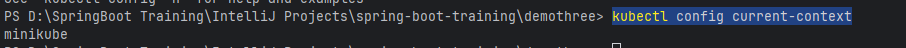

## Run with Docker

- need to mvn clean and install to create the jar file first
- docker build -t [image-name]:[tag] .
    - Example: docker build -t demothree:1.0.0 .
    - -t → to create tag
- docker run -d -p [port-to-hit]:[port-exposed] --name [container-name] [image-name]:[tag]
    - Example: docker run -d -p 8082:8080 --name demothree-app demothree:1.0.0
    - -d → detach (berjalan terpisah)
    - -p → declare port
    - --name → declare name for the container

## Other commands:
- docker --help (get list of commands)
- docker ps -a (check running container)
- docker stop [container-name] (stop specific container)
- docker start [container-name] (start specific container)
- docker rm [container-name] (delete specific container)
- docker rmi [image-name]:[tag] (delete specific image)
- docker images (check built images)
- docker push [username]/[image-name]:[tag]

**image-name harus sama dengan nama di docker hub**

### Using docker-compose.yaml
docker-compose build

## Run with Kubernetes
### Ciri config kube
pasti ada "akms" (cek k8/service.yaml)
- apiVersion:
- kind:
- metadata:
  - name:
- spec:

### Build and Run
- Makesure your terminal is in the yaml file's directory
- Build image (from local pc) with docker as usual
  - Example with docker compose, run command:
    -     docker compose -f docker-compose.[env].yaml build
- Push to docker hub (from local pc)
  - Run command: 
    -     docker push keziaeka/demo-three:[env]-1.0.0
- Pull from docker hub to where the minikube/kube runs (if it runs in local pc then we don't have to pull because we have it locally from the build image before)
  - Run command:
    -     docker pull keziaeka/demo-three:[env]-1.0.0
- Apply yaml config
  - Run command:
    -     cd .\k8\
    -     kubectl apply -f deployment-[env].yaml
    -     kubectl apply -f service-[env].yaml
  - Other command:
    -     kubectl get deployment
    -     kubectl get nodes
    -     kubectl get pods
    -     kubectl get service
    -     kubectl describe pods/[pod-name]
      - Example: kubectl describe pods/myapp-dev-demo-7694cc6f49-22cmc
    -     kubectl delete -n default pod [pod-name]
    -     kubectl delete -n default deployment [deployment-name]
- Run the service with command:
  - minikube service [service-name]
    - Example: 
      -     minikube service myapp-dev-demo
- To get what IP we could hit, we can get the "INTERNAL-IP" from running this command:
  - kubectl get nodes -o wide
  
- To get what port we could hit, we can refer to service.yaml [nodePort]

- Normal case: http://192.168.49.2:30080/api/profiles/
- For minikube, we can't use the ip and port above. minikube does a tunneling for the service. We can run this command:
  - minikube service [service-name]
    - Example: 
      -     minikube service myapp-dev-demo
      
    - Result: http://127.0.0.1:5393/api/profiles/
     

- To check where we run the kubernetes:
  -     kubectl config current-context
  
- if we use docker-desktop, it will show docker-desktop
- To change the context, run command:
  -     kubectl config use-context docker-desktop